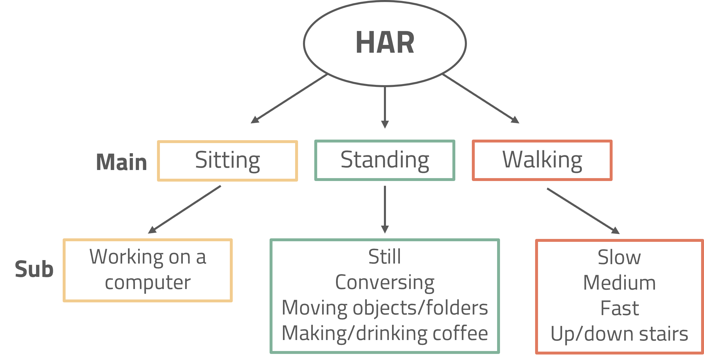
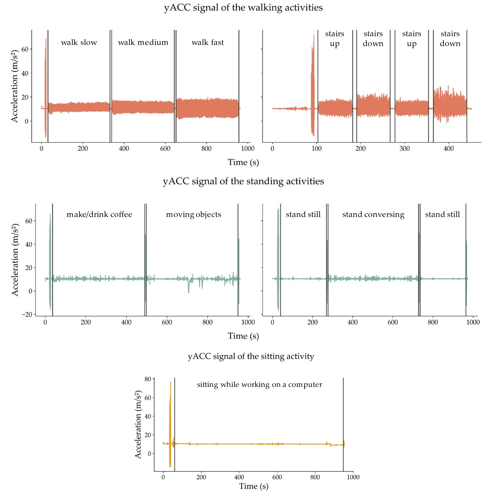
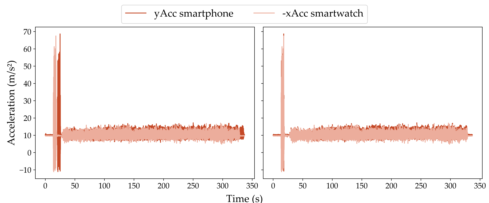

# Unsupervised Human Activity Recognition Models for Characterizing Office Work Tasks

## Table of Contents
- [About](#about)
- [Synchronization](#synchronization)
- [Signal Pre-processing](#Signal_Preprocessing)
- [Feature Extraction](#Feature_Extraction)
- [Experiments](#experiments)
  - [Experiment 1 - Feature Selection](#experiment1)
  - [Experiment 2 - Cluster Stability](#experiment2)
  - [Experiment 3 - Cluster Imbalance](#experiment3)

## About 
The python code available in this project is part of the methods for the Master Thesis
"Unsupervised Human Activity Recognition Models for Characterizing Office Work Tasks".
In the following sections, the synchronization, pre-processing, and feature extraction pipelines utilized in this work will be explained.
For Human Activity Recognition (HAR) in office environments, three experiments were conducted: feature selection, cluster stability, and data imbalance.

In this thesis, data was acquired from 19 subjects performing 9 different tasks. The tasks were analysed hierarchically as follows:

Five acquisition sessions were devised, grouping similar tasks within the same recording. At the start of each acquisition, subjects performed ten vertical short jumps to later synchronize the signals from the different devices. Short segments were performed in between tasks to later allow for segmentation.
The y-axis accelerometer signals of the five sessions are shown bellow:

## Synchronization

The "**synchronization**" function loads, synchronizes android sensors from the same device, resamples the signals, and synchronizes between two devices. To use the following code effectively, data should be acquired using the PrevOccupAI APP.

There are two stages to synchronize multiple android sensors from different devices:
1. **Synchronize android sensors within the same device**. Using the timestamps of the first sensor to start and the last to stop acquiring;
2. **Synchronize sensors between devices**. The following methods are supported:
   + *Cross-correlation*: synchronizes based on the maximum cross-correlation from the Accelerometer (ACC) signals from the two devices: y-axis for the smartphone and -x-axis for the smartwatch. For this method to work correctly, for each acquisition the subject must perform an initial segment of vertical short jumps, with the arms straight and parallel to the body.
   
   + *Timestamps*: synchronizes the signals based on the timestamps of the  first sample received from each device, contained in the logger file (opensignals). If this file does not exist or does not have the necessary timestamps, the timestamps in the filenames are used.

This is done using the *synchronization* function. This function allows the user to choose
which sensor data to load and synchronize. If the user chooses sensors from only one
device, only these are synchronized. This function has the following parameters:

+ raw_data_in_path (str): path to the main folder containing subfolders with raw sensor data (i.e., ../main_folder/subfolders/sensor_data.txt)
+ sync_android_out_path (str): path to the location where the synchronized android sensor data, within each device, will be stored.
+ selected_sensors (Dict[str, List[str]): dictionary containing the devices and sensors chosen to be loaded and synchronized (i.e., selected_sensors = {'phone': ['acc', 'gyr', 'mag'], 'watch': ['acc', 'gyr', 'mag']}).
+ output_path (str): path to the location where the file containing the synchronized data, from the multiple devices, should be saved.
+ sync_type (str): method for synchronizing data between devices (crosscorr or timestamps).
+ evaluation_filename (str): name of the file which will contain the synchronization evaluation report.
+ save_intermediate_files (bool): keep the csv files generated after synchronizing android
        sensors. False to delete. If there's only signals from one device, these files are not deleted.

## Signal_Preprocessing

The *processing* package has three python files: task_segmentation, filters, and pre_processing. The *processor* or *process_all* functions in the *pre_processing* file apply the task segmentation method and the filters to the signals.
This function attributes filenames depending on the segment being segmented.

For task segmentation, the tasks performed within the same recording are segmented if the user performs ten-second stops between different walking activities and ten-second stops with a jump in the middle for standing activities.

To segment walking tasks, an onset-based task segmentation was implemented, while for standing and walking tasks, a peak-based approach was implemented. Some thresholds in the *segment_tasks* function in *task_segmentation.py* might need adjustments.

For filtering, the *apply_filters* in *pre_processing.py* applies a Butterworth lowpass filter to remove high frequency noise, a median filter for smoothing, and another lowpass filter to isolate the gravitational component which is then subtracted from the ACC signals. The cutoff frequencies and window lengths can be adjusted in the functions in *filters.py*.

The *processor* function has the following parameters:

+ sync_data_path (str): Path to the folder (i.e., sync_devices) containing the synchronized data main_folder/subfolder/sync_devices/sync_data.csv
+ output_base_path(str): Path to the base path were the raw segments and filtered segments should be saved
+ device_sensors_foldername (str): Name of the folder containing the loaded sensors and devices (i.e., acc_gyr_mag_phone_watch)
+ sub_folder (str): Name of the subfolder which contains the synchronized data main_folder/subfolder/sync_devices/sync_data.csv
+ raw_folder_name (str): (default = raw_tasks) Name of the folder where to store the raw signal segments
+ filtered_folder_name (str): (default = filtered_tasks) Name of the folder where to store the filtered signal segments
+ save_raw_tasks (bool): (default = True) Save the raw signal segments. False not to save
+ fs (int): sampling frequency
+ impulse_response_samples (int): Number of samples to be cut at the start of each segment to remove the impulse response of the filters

## Feature_Extraction

The TSFEL package (https://tsfel.readthedocs.io/en/latest/) was utilized for windowing and feature extraction. 
The *feature_extractor* function in *feature_engineering.feature_extraction.py* extracts features from sensor data files contained within the sub-folders of a main directory, as follows:
    main_dir/subfolders/sync_signals.csv.
1. Loads the signals to a pandas dataframe
2. Applies a sliding window on the columns of the dataframe (signals) and extracts the features chosen in the
    cfg_file.json. Check TSFEL documentation here: https://tsfel.readthedocs.io/en/latest/
3. Adds a class and subclass column based on the original file name
4. Balances the dataset to ensure the same amount of data from each class. Within each class, the subclass instances
    are also balanced to ensure, approximately, the same amount of data from each subclass. Each subclass should be
    equally sampled inside their respective class (the signals from each subclass should have the same duration) for
    this function to work correctly.
5. Saves the dataframe to a csv file where the columns are the feature names and the class and subclass, and the
    rows are the data points. The file name is generated automatically with addition to the prefix and suffix.

This function has the following parameters:

+ data_main_path (str): Path to the folder. Signals are contained in the sub folders inside the main path. For example:
        devices_folder_name/*folder*/subfolders/sync_signals.csv
+ output_path (str): Path to the folder where the csv file should be saved.
+ subclasses (List[str]): List containing the name of the subclasses to load and extract features. Supported subclasses:
            "sit": sitting
            "standing_still": Standing still
            "standing_gestures": Standing with gestures
            "coffee": Standing while doing coffee
            "folders": Standing while moving folders inside a cabinet
            "walk_slow": Walking slow speed
            "walk_medium": Walking medium speed
            "walk_fast": Walking fast speed
            "stairs": Going up and down the stairs
+ json_path (str): Path to the json file containing the features to be extracted using TSFEL
+ Prefix (str): String to be added at the start of the output filename
+ Suffix (str): NString to be added at the end of the output filename
+ devices_folder_name (str): String to be used to form the output filename. Should be indicative of the sensors and devices used. If using "feature_extraction_all" this should be the name of the main folder as follows:
        *devices_folder_name*/folder/subfolders/sync_signals.csv
        *acc_gyr_mag_phone*/filtered_tasks/walking/walk_slow_signals_filename.csv

